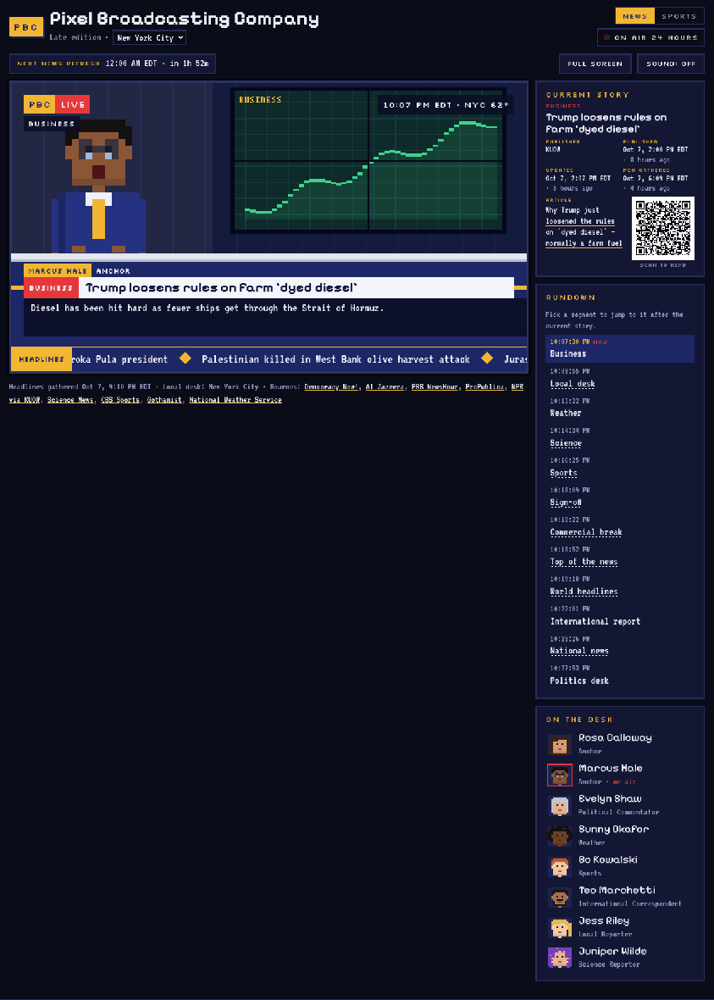
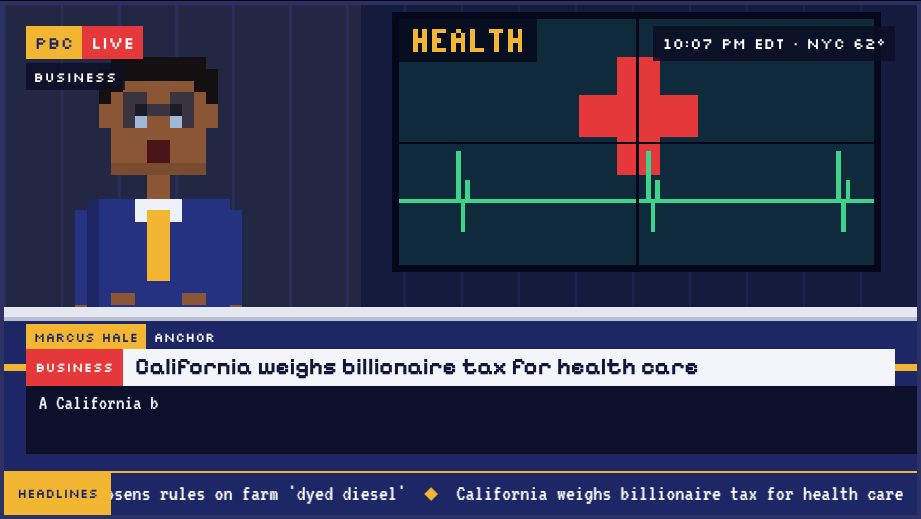
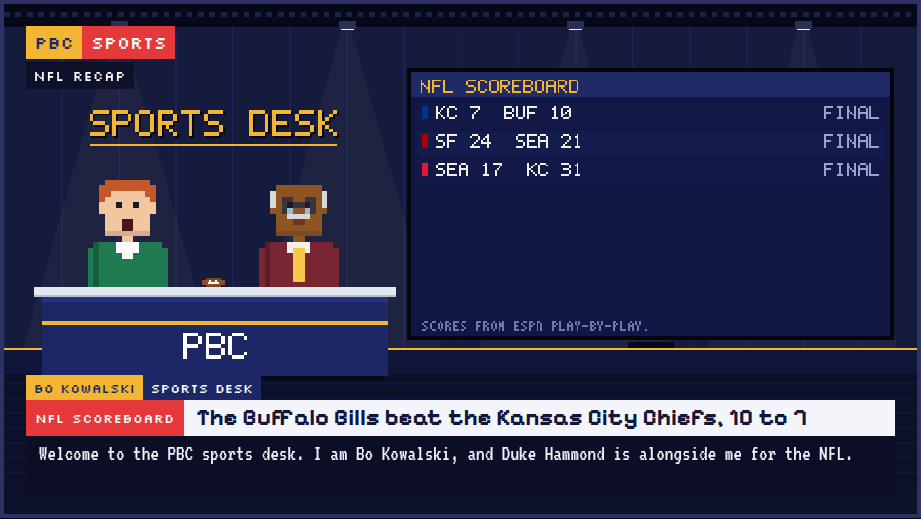
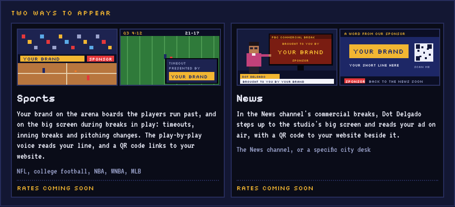

# The PBC look book

Everything that makes Pixel Broadcasting Company look like itself: the page around the broadcast, the spacing and borders, how the screen and its graphics are built, how characters are drawn, and how the sets are put together. `tools/NEW_PAGE.md` says how to build a new page step by step; this file is the reference it points to. When something new is drawn or styled, it follows this file. When a new look is agreed (a new character, a new set), it gets written down here in the same pull request.

Fonts and page colors are in the `:root` block of `shared/pbc.css` and are listed in `tools/NEW_PAGE.md`. This file covers everything else.

## 1. The page

| What | Value | Where it's set |
| --- | --- | --- |
| Page width | at most 1400px, centered | `.pbc-page` |
| Page padding | 12px top, 16px sides, 32px bottom | `.pbc-page` |
| Space between everything (masthead, control row, screen, cards) | **12px**, always | `gap:12px` on `.pbc-page`, `.pbc-top`, `.pbc-main`, `.side` |
| Right column | 300px | `.pbc-page` grid |
| Below 900px wide | one column: masthead, broadcast, then the right column underneath | `.pbc-page` |
| Below 640px (phones) | ON AIR and the switch share a row; FULL SCREEN and SOUND split the full width | `.pbc-side`, `.pbc-btns` |
| Control row | 36px tall: the page's own control on the left, FULL SCREEN and SOUND on the right | `.pbc-ctl`, `.pbc-btn` |
| Masthead | the gold PBC mark with a 3px navy pixel shadow, "Pixel Broadcasting Company" in Pixelify 700, a subtitle line in muted body text, then NEWS \| SPORTS and ON AIR on the right | `.pbc-mast` |
| Company footer | under every page, built by `shared/pbc.js` | `.pbc-sitefoot` |

Spacing inside things uses a small set of steps: **2, 4, 6, 8, 10, 12, 14, 16, 20px**. Reuse one of those rather than inventing 13 or 15.

## 2. Borders, edges and shadows

PBC is square and hard-edged, like a game screen.

- **No rounded corners** anywhere (`border-radius` is never used; form fields set it to 0).
- **No soft shadows or CSS gradients.** Depth comes from hard pixel shadows: a solid offset with no blur, like `box-shadow:3px 3px 0 var(--navy)` on the PBC mark and `.4cqw .4cqw 0 var(--navy)` on big gold buttons.
- **Cards and buttons:** `2px solid var(--line)` on `var(--panel)`. Hover and the selected state turn the border gold.
- **Inside every card: 14px top, 16px sides** (`.pbc-card`, `.co-card`, and the Sports panels, whose titles and rows are inset 16px). One padding on every page and every screen size.
- **A bold word inside text** is set in Pixelify Sans 500 at 19px, the way News shows the cast names (`.co-card` text, the Sports play feed). The body font is never thickened.
- **The broadcast monitor:** a `4px` bezel in `var(--frame)` plus a `4px` outer ring in `var(--shadow)` (`.pbc-screen`). Pictures inside the page (Dot's desk, the ad previews) use the same `4px` bezel or `2px` for small ones.
- **Windows over the sports broadcast** (booth, scoreboard): `3px` cream border `var(--win-edge)`, a `3px` dark ring outside and a `2px` blue line inside (`.win`).
- **Focus rings:** gold outline, 2px or 3px, 2px away from the element.
- **Dividers in lists:** `1px dashed var(--rule)`; dotted underlines (`underline dotted 1px`) mark something clickable inside text, like rundown picks.
- **Gold rule:** a gold line marks the top edge of a desk front, the ticker and gold notices (`border-top:.3cqw solid var(--gold)` on the ticker).

## 3. The broadcast screen

- Always a **16:9** `
`. It sets `container-type:inline-size`, so anything over it is sized in **`cqw`** (1cqw = 1% of the screen's width) and scales with the screen.
- **The picture** is a small canvas drawn at its own low resolution and scaled up with `image-rendering:pixelated` (News draws at **384×216**, Sports at **480×270**, both 16:9). Draw at that resolution; never draw at screen resolution.
- **Graphics over the picture** are HTML on top of the canvas, laid out in `cqw`. The bug, segment tag and lower third are shared (`.pbc-bug`, `.pbc-seg`, `.pbc-third` in `shared/pbc.css`), so News and the Sports Desk show the same ones:
  - corner bug: gold `PBC` plate with a red `LIVE` plate, `2.4cqw` in from the top left
  - segment tag under it and the clock top right, on `var(--overlay)` captions
  - lower third: a name plate (gold name, navy role), then a red category chip and the headline on `var(--paper)` in Pixelify 700, then the summary on `var(--overlay-90)`
  - ticker: `4.6cqw` tall along the bottom, navy with a gold top rule, a gold HEADLINES label and gold diamonds between items
  - LIVE NOW chip (`shared/live.js`) under the clock. On Sports it may shrink to 7px text on a phone so the whole score fits; on News it stops at 10px (Chris's call)
  - Sports keeps the same vocabulary inside its windows: Silkscreen labels, gold scores, `1.6cqw` insets
- **Full screen** is the same screen letterboxed in black with FULL SCREEN and SOUND floating top right; they fade after 3 seconds without movement. It comes from `PBC.fullScreen()`.
- **First visit:** a TUNE IN (News) or PRESS START (Sports) card over a dimmed picture, gold button with a navy pixel shadow, and a "Watch without sound" link.

## 4. Pixel art rules (every canvas)

1. **Rectangles on whole pixels only.** Draw with `fillRect` at rounded coordinates (every file has a small `R(color, x, y, w, h)` helper). No lines, arcs or anti-aliased shapes; circles are built from rows (`disc()` in `index.html`).
2. **No smoothing:** `ctx.imageSmoothingEnabled = false` and `image-rendering:pixelated; image-rendering:crisp-edges` on the canvas element.
3. **Text on a canvas is PBC's one pixel lettering, never canvas fonts.** Everything is drawn with `PBC_ADS.pixText()` from `shared/ads.js`: FONT3 (3×5) for clocks, labels, tags and jersey numbers, FONT5 (5×7) for brand names and big headings, scaled up by whole pixels when it needs to be bigger. News (`txt()`), Sports (`digit()`), the Sports Desk and the Marketing Division all call it. A missing character is added to FONT3/FONT5 there, never drawn from a font of a page's own; the style check fails on a second font table. The only canvas font is Press Start 2P, for markings painted on the sports fields (end-zone names, yard and court numbers).
4. **Lettering gets a 1px dark drop shadow** (`#05060d`, drawn 1px right and down first) whenever it sits on a busy picture.
5. **Shading by mixing, not new colors:** a side or shadow is the base color mixed 25% toward black (`mix(color, "#000000", .25)`); a highlight is 15–25% toward white. Light from a lamp is a pale yellow (`#fff2c0`) shape at 4–6% opacity.
6. **Random but fixed.** Crowds, skylines, stars and freckles use a seeded random generator (`rng(seed)`, `mulberry(seed)`) so the same scene draws the same way every frame and every visit.
7. **Things on a set are framed** with a 2–3px very dark edge (`#05071a` or `#05060d`) around screens, windows and boards.
8. **Motion is stepped:** blinks, mouth flaps and lights toggle on timers (`Math.floor(t / 120) % 2`) instead of fading. Respect `prefers-reduced-motion`.
9. **Pictures keep their own palettes.** Canvas and SVG art may use any colors (team colors, sky, skin tones); the style check only covers page CSS. Reuse the colors already listed in this file before adding new ones.

## 5. Characters

There are two drawing styles for people, plus sprites for players. **A new person uses one of these; don't invent a third style.** A character keeps the same colors in every style they appear in (Bo's green jacket and Dot's pink one are the same on News, the Sports Desk and the Marketing Division page).

### Newsroom cast: `person(look, ctx, x, y, scale, state)` in `shared/people.js`

A full figure on a **14 × 32 pixel grid** (head 0–11, body 12–21, legs 22–32), drawn at scale 1 on the wide shot and larger in close-ups.

- **`look`**: `skin`, `hair`, `style`, `coat`, `shirt`, `pants`, and optionally `tie`, `shoe`, `dress`, `glasses`, `earring` (all colors).
- **Hair styles:** `short`, `long`, `bob`, `curly`, `pony`, `beard`, `wild`, `bald` (a fringe at the sides). Extras: `stache`, and `cap` with `capBrim` and `capLogo` for the sports guests who wear one.
- **States:** `seated` (no legs, hands on the desk), `headOnly`, `point` (arm out to the weather wall), `mic` (field reporter), and from `anim()`: `blink` (130ms every ~3.7s), `open` mouth (flaps every 105ms while speaking, with pauses), `bob` (head moves up 1px every few beats).
- Face: skin block with a 12% darker jaw line, 1px dark eyes, a 2px mouth; glasses are thin dark frames with a pale blue glint.

| Key | Name | Role | Skin | Hair (style) | Coat | Extras |
| --- | --- | --- | --- | --- | --- | --- |
| A | Rosa Calloway | Anchor | `#d49a73` | `#3b2216` long | `#b8283e` | |
| B | Marcus Hale | Anchor | `#8a5636` | `#141012` short | `#253282` | gold tie, glasses |
| P | Evelyn Shaw | Politics | `#e5b48e` | `#c3c6d0` bob | `#5e2d78` | |
| W | Sunny Okafor | Weather | `#6a4128` | `#16110f` curly | `#f2b632` | dress, red shoes |
| S | Bo Kowalski | Sports | `#f1c6a0` | `#c4582b` short | `#1f7a52` | |
| I | Teo Marchetti | International | `#a8714c` | `#1d1612` beard | `#a5835a` | |
| L | Jess Riley | Local | `#f3caa4` | `#e2b84f` pony | `#2b8fb3` | |
| X | Juniper Wilde | Science | `#e8b48f` | `#7a3fb8` wild | `#1e8c7e` | dress, gold shoes, earrings |
| D | Dot Delgado | Head of Sales | `#b97a52` | `#1c1418` bob | `#c2417a` | glasses, gold earrings |

The source of truth is `CAST` in `index.html`; update this table when it changes.

### Sports booth: `drawAnnouncer(g, x, look, talking, mouthOpen, blink)` in `sports/index.html`

A head-and-shoulders bust **36 pixels wide**, two to a **76 × 38** booth (seats at x=1 and x=40) behind a wooden desk, with a dark headset and mic.

- **`look`**: `jacket`, `shirt`, `tie`, `skin`, `hair`, `brow`, and optionally `longHair`, `bald`, `cap` (+ `capBrim`, `capLogo`), `glasses`, `stache`.
- The booth wall is `#24305e` with `#2f3d78` stripes every 8px; the desk is `#5b3a1e` with a `#7d5230` top edge.
- Mouths flap every 120ms while talking; each announcer blinks on their own timer.
- **Every sport has its own pair** (`CAST.<sport>.A` play-by-play, `.B` color) and booths are never shared. On the Sports Desk, Bo Kowalski hosts with one of that sport's pair as the guest, and Dot reads the break. In the booth window (during replays) they are drawn in this style (`DESK_BO`, `DESK_DOT` in `sports/show.js`); at the studio desk they are drawn with `person()`, Bo and Dot exactly as the newsroom draws them and the guests through `deskPerson()`, which turns a booth look into a newsroom look (jacket to coat, `longHair` to `long`, `bald`, `stache`, `cap` kept).

### Players: `drawPlayer()` in `sports/index.html`

Sprites **10 × 18 pixels**, with a 9×2 shadow (`rgba(0,0,0,.35)`) under anyone standing.
- Football: helmet with a center stripe. Baseball: cap and a bat. Basketball: no helmet; skin and hair come from the player's headshot when it can be read.
- Colors come from the team's data through `kit()` (football), `kitMLB()` and `kitBB()`: home teams wear their color, away teams wear white `#f2f0e8` with their color as trim; the number color is picked for contrast.
- Jersey numbers are drawn in the shared 3×5 lettering (`digit()` calls `pixText()`). Legs alternate between two frames to walk.
- Benches and dugouts: players walk on and off from their own bench; a sitting player is 3px shorter with no shadow.

### Animals

- **Batty**, the newsroom's black cat: about 14 pixels long, black `#121218` with a `#2c2c3a` highlight and yellow eyes `#f2d14a`. Poses: curled asleep (breathing, with a floating Z), walking, sitting with a swishing tail. Sleeps in a red cushion `#7a2a3a`/`#9c3a4c` at the end of the anchor desk (`drawCat()` in `index.html`), and on the Marketing Division page at 4 screen pixels per pixel (`advertise/office.js`).
- **Pip** the axolotl, Juniper's lab companion (`drawPip()` in `index.html`).

## 6. Sets

Every studio is built from the same parts, so a new desk or channel looks like it's down the hall from the newsroom.

**The PBC studio palette** (use these for any new studio):

| Part | Color |
| --- | --- |
| back wall | `#151b3d`, with 1px vertical panel lines `#1b2250` every 1/16 of the picture's width (24px of the newsroom's 384, 30px of the Sports Desk's 480: the same on screen) |
| ceiling strip | `#07091a`, with a row of `#1c2146` light blocks |
| studio lights | `#2a2f55` cans with a `#fff2c0` lens; light cones in `#fff2c0` at 4–6% opacity |
| floor | `#0c1029` with `#10153a` lines every 8px |
| desk | navy `#1d2766` front, `#253282` top edge, a gold `#f2b632` stripe and the PBC logo; a pale `#e3e7f0` desk top |
| screen frames | `#05071a`, 2–3px |

**The newsroom** (`drawStudio()` in `index.html`, 384×216): a window on the left showing the local city's sky and skyline for the hour (`SKY` palette, stars and moon at night, a sun that crosses the day), a small sports monitor on a stand, the **video wall** in the middle (world globe, flag, capitol, city, weather, business chart, science orbit, Good News sunrise, sports field, live remote, or a story's map and category art from `news/visuals.js`), the **weather wall** on the right, the anchor desk with Rosa, Marcus and Evelyn, Bo and Sunny standing at either side, and camera silhouettes with a blinking red tally light in the front corners. Shots are crops of that one picture (`SHOTS`): the wide shot at 1×, close-ups at 2×.

Other newsroom scenes reuse the same parts: the over-the-shoulder shot (`drawOts`), the science lab (`drawLab`), field reports (`drawIntl`, `drawLocal`), the weather center (`drawWx`) and the commercial break (`drawAds`).

**The Sports Desk** (`deskSet()`, `deskAnchors()` and `deskDrawPanel()` in `sports/show.js`, 480×270): a studio shot built from the palette above. The back wall with a `#10153a` baseboard and gold rule, four ceiling lights with cones, SPORTS DESK in gold lettering (scale 2) on the wall, Bo and the guest seated at the newsroom's anchor desk on the left (`person()` at scale 3, desk top at y=150, a football between them), and the big screen on the right (x 214–466, y 36–176, on a dark mount) holding the information panel or the break's ad: `#101743` with a `#1f2a66` heading bar in gold, rows alternating `#121848`/`#141c4e`, gold headings, `#f2f0e8` text, green `#9be15d` numbers. Over it, the newsroom's graphics: a `PBC` `SPORTS` bug, the rundown segment as the tag (NFL RECAP, COMMERCIAL BREAK), and a lower third with the speaker, the screen's heading as the red category, a headline, and the line being read. The booth and scoreboard windows are put away while the studio is on screen and come back only for replays and live games.

**Stadiums and courts** (`buildField()`, `buildDiamond()`, `buildCourt()`, `f1BuildTrack()`): drawn once per game into an off-screen canvas. A seeded crowd in mixed skin tones and the two teams' colors, a wall of sponsor boards, then the playing surface in its real proportions (football: 8 pixels a yard, 5-yard bands alternating `#2e8a3c`/`#2a7f37`, end zones in team colors with the team name).

**Commercial breaks** (`shared/ads.js`): every ad is a brand name, a short line and a `bg`/`fg` color pair, lettered in FONT5/FONT3, with a QR code drawn in pixels when it has a website, a SPONSOR tag, and faint scan lines. The house ad is gold on `#0c0e1c`. Sponsor boards (`adBoard()`) are the same ad on a 1px dark frame.

## 7. Company pages

The Marketing Division page (`advertise/`) is the model for information pages:
- a **hero card** with a gold label, a big Pixelify headline or lead sentence, and plain body text
- a gold **banner** for anything temporary (OPENING SOON)
- **side-by-side items** (`co-menu`), each with a 16:9 pixel picture (SVG, 160×90, drawn in the PBC palette with Silkscreen lettering), a Pixelify heading, a short paragraph, and a price row
- **numbered steps** (`co-steps`), **number tiles** (`co-stats`), a **form** (`co-form`) and **questions** (`co-faq`)
- a living touch: Batty napping along the intro card, Dot answering questions at her desk
- the right column is a directory of the company pages in a card

## 8. Sound (for completeness)

SOUND cycles OFF, BLIPS, VOICES. Blips are short square-wave beeps pitched per character (`VOICE` in `index.html`); voices are the browser's speech voices, on-device first. The theme music, stings and break bed are generated in `shared/music.js`. No crowd noise on Sports.

## Keeping this current

- A new character: add them to the table above (key, name, role, colors, extras), drawn with `person()` or `drawAnnouncer()`.
- A new set: list its parts and colors in section 6, built from the studio palette.
- A new page color or font need: `shared/pbc.css`, as `tools/NEW_PAGE.md` says.
- Replace the pictures in `tools/look/` when the look changes.
